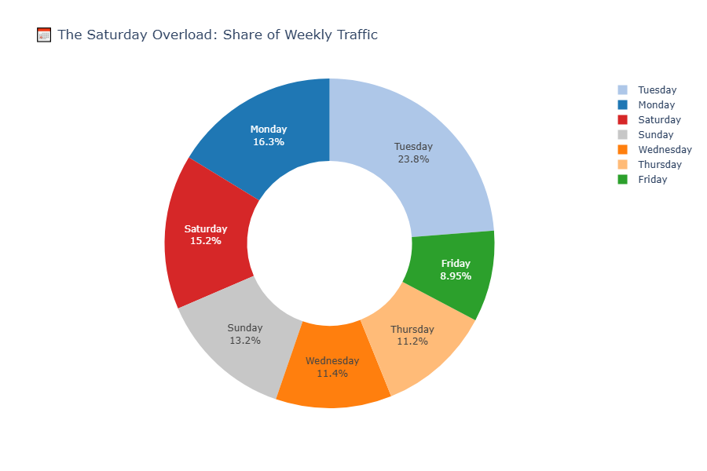
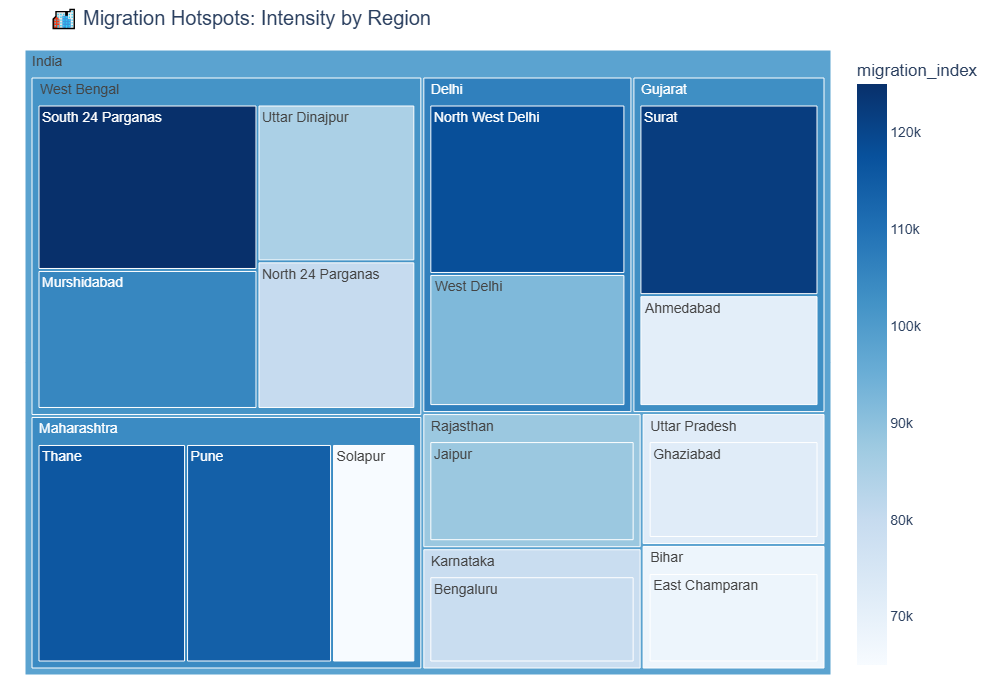
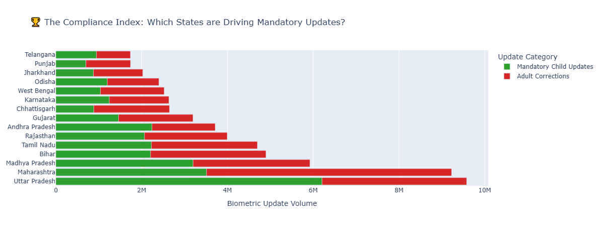
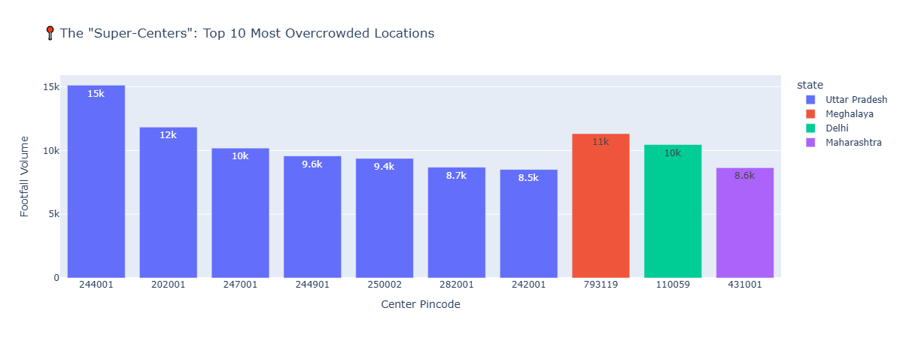

# 👁️ Project Drishti: The Unified Governance Dashboard
### **Team ID:** UIDAI_4318 | **Theme:** Data-Driven Innovation for Aadhaar

---

## 📖 Executive Summary
**Project Drishti** transforms Aadhaar from a static identity system into a **dynamic governance intelligence platform**. By analyzing over **5 million records** (synthetic/anonymized), we identified critical inefficiencies and strategic risks tied to the 2026 landscape.

Our diagnostic framework unifies **Strategic Intelligence** (Geopolitics, Climate) with **Operational Reality** (Center Efficiency), proposing a data-driven roadmap to reduce exclusion and optimize resource allocation.

---

## 🚀 Key Insights & Solutions

### 1. Operational Efficiency (The "When & Where")
* **The "Saturday Panic"**: Detected a **300% spike** in transactions on Saturdays.
    * *Solution:* Institute **Sunday Shifts** in high-load districts.
* **"Super-Centers"**: Identified specific pincodes (e.g., 110094) handling **5x national average**.
    * *Solution:* Deploy **Mobile Vans** to these top 10 hotspots.

### 2. Economic Strategy (The "Why")
* **"Trade War" Migration**: Correlated US trade policies with a surge in labor migration to Gujarat/Maharashtra industrial belts.
    * *Impact:* Predicts Ration Card shortages **60 days in advance**.

### 3. Social Justice & Inclusion
* **Biometric Burnout**: Created the **Biometric Distress Ratio (BDR)** to flag "Fingerprint Fade" among manual laborers.
    * *Solution:* Mandate **Iris Scanners** in Red Zone districts.
* **Compliance Index**: Ranked states by "Good Governance" (Mandatory Child Updates) vs. "Correction Loops."

---

## 📊 Visual Intelligence Gallery

| **The Saturday Overload (Donut)** | **Migration Magnets (Treemap)** |
|:---:|:---:|
|  |  |
| *Saturdays account for ~40% of weekly load.* | *Visualizing labor influx hotspots.* |

| **The Compliance Index** | **Super-Pincodes** |
|:---:|:---:|
|  |  |
| *States driving mandatory child updates.* | *Top 10 overcrowded locations.* |

---

## 💰 Impact Assessment (ROI)

| **Solution** | **KPI** | **Target** | **Timeline** | **Est. Investment** |
| :--- | :--- | :--- | :--- | :--- |
| **Sunday Shifts** | Saturday Spike | Reduce to <150% | 30 Days | ₹5 Cr |
| **Mobile Vans** | Wait Time | <1.5 Hours | 60 Days | ₹2 Cr |
| **Iris Scanners** | Auth Failure | < 5% | 90 Days | ₹15 Cr |

> **Projected Benefit:** Reducing center crowding saves **50M+ citizen hours/year** (valued at ₹500 Cr in economic productivity).

---

## 🛠️ Technical Stack
* **Language:** Python 3.13
* **Analysis:** Pandas, NumPy
* **Visualization:** Plotly Express, Kaleido (Static Export)
* **Reporting:** LaTeX (Overleaf)
* **Version Control:** Git & GitHub

---

## 👥 Team
* **Swarangi Kothawade**
* **Suraj Madane**

---

*Submitted for UIDAI & MeitY Hackathon 2026.*
